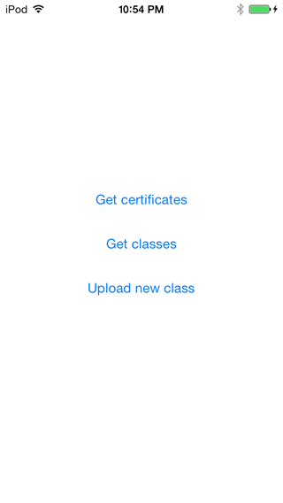
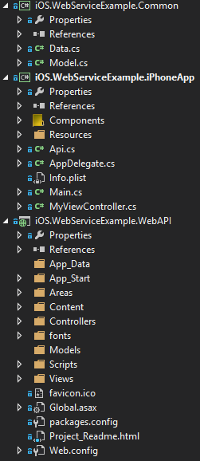

Introduction
-------
This sample shows how to connect to ASP.Net Web API from Xamarin.iOS to GET and POST some data.

Setup
-------
1. All projects were created using Visual Studio 2013
2. On iOS.WebServiceExample.iPhoneApp MyViewController.cs change the variable url to your local address so that the iPhone app can locate your Web API instance.
3. For my local testing I created a virtual directory to run the Web API

Details
-------
1. Solution consists of 3 projects
	

	- iOS.WebServiceExample.Common (Data model & sample data taken from http://xamarin.com/university)
	
	- iOS.WebServiceExample.iPhoneApp (Xamarin.iOS application)
	The app consists of 3 buttons that call the Web API methods asynchronously.
	
	- iOS.WebServiceExample.WebAPI (ASP.Net Web API)
	The Test controller exposes 3 methods, 2 GET and 1 POST.
	

Xamarin Components Used
-------
[Json.NET](http://components.xamarin.com/view/json.net/)