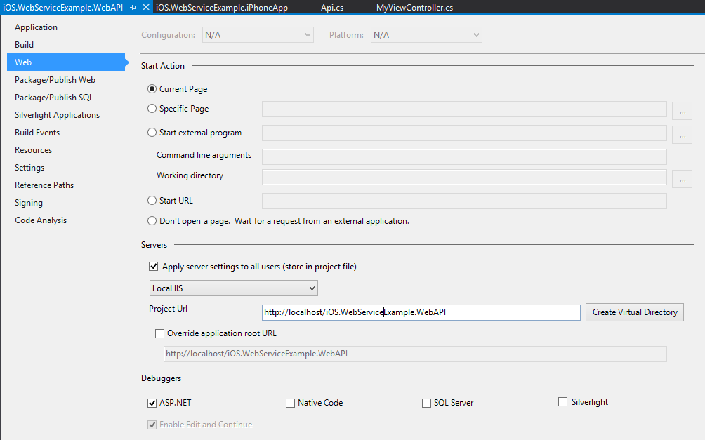
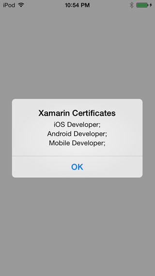
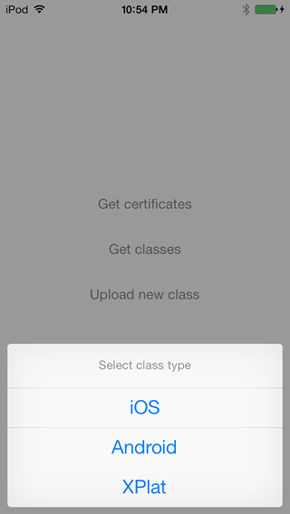
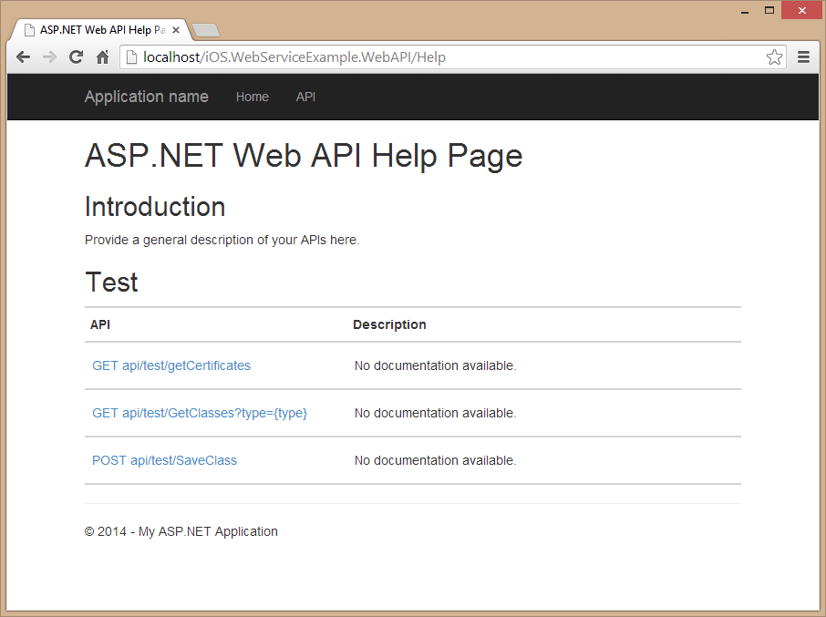

iOS.WebServiceExample
=====================

Xamarin.iOS Web Service Example

Introduction
-------
This sample shows how to connect to ASP.Net Web API from Xamarin.iOS to GET and POST some data.

Setup
-------
1. On iOS.WebServiceExample.iPhoneApp MyViewController.cs change the variable url to point to your Web API.
2. For my local testing I created a virtual directory to run the Web API

Details
-------
1. Solution consists of 3 projects
	- iOS.WebServiceExample.Common (Data model & sample data)
	- iOS.WebServiceExample.iPhoneApp (Xamarin.iOS application)
	- iOS.WebServiceExample.WebAPI (ASP.Net Web API)

	
Screenshots
-------

-------

Xamarin Components Used
-------
[Json.NET](http://components.xamarin.com/view/json.net/)